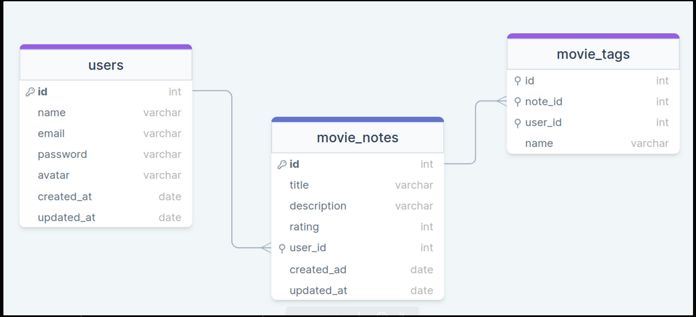

<p align="center">
 <a href="#Description">Description</a> |
 <a href="#Features">Features</a> | 
 <a href="#Technologies">Technologies</a> |
 <a href="#How to use">How to use</a> |
 <a href="#Software">Software</a> |
 <a href="#License">License</a> |
 <a href="#MyLinkedIn">My LinkedIn</a> 
</p>

API for RocketNotes Web App.



<div id="Description">

## Description

Node project developed during Stage 08 of Rocketseat Explorer program.

</div>
<div id="Features">

### Features

- [x] User registration
- [x] Upload files
- [x] Register notes & tags
- [x] Encrypt password
- [x] E-mail validation
- [x] Authentication routes

</div>
<div id="Characteristics">

## Characteristics:

- NodeJS;
- Database Manipulation;
- HTTP (Routes and Methods);
- Routes & request params;
- Middlewares;
- JWT authentication;
- Files manipulation;

</div>
<div id="Technologies">

## Technologies:

- Languages: `Javascript`
- Libraries: `bcryptjs` | `express` | `express-async-errors` | `jsonwebtoken` | `knex` | `sqlite` | `sqlite3` | `multer` | `cors` | `dotenv` | `pm2`
- Version control: `Git & Github`

</div>
<div id="How to use">

## How to use:

#### Clone this repository

```bash
$ git clone [https://github.com/arks-lacerda/api-notes.git](https://github.com/arks-lacerda/api-movies.git)
```

#### Access project folder in terminal/cmd

```bash
$ cd /api-movies
```

#### Install the dependencies

```bash
$ npm install
```

#### Run as migrate knex

```bash
$ npm run migrate
```

#### Run the application in development mode

```bash
$ npm run dev
```

#### The server will start on port:3333 - go to <http://localhost:3333>

</div>
<div id="Software">

## Software

[VSCode](https://insiders.vscode.dev/)

</div>
<div id="License">

## 📝 License

This project is under the [MIT]() license. See the LICENSE file for more details.

</div>
<div id="MyLinkedIn">

## 🔎 My LinkedIn

<a href="https://www.linkedin.com/in/arks-lacerda/"></a>

<h3 align="center">Developed by Arthur Lacerda ☕</h3>
</div>
